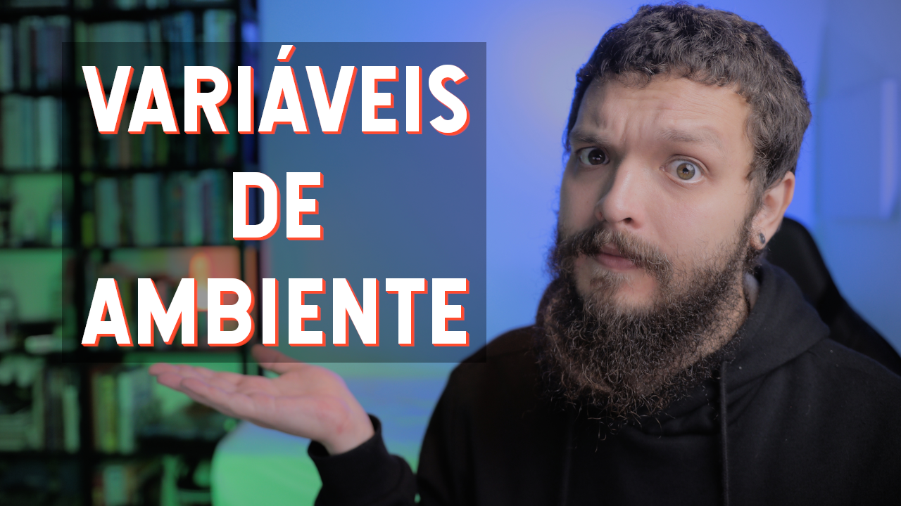

# ldp-thumb

## This project is just an idea, there is **no code implemented YET**

Project created to automate Live de Python's youtube channel thumbnail

## TODO

- [ ] Enhance image, currently made with [darktable](https://www.darktable.org/) -> Pillow
- [ ] Remove background, currently made with [rembg-cli]((https://pypi.org/project/rembg/)) -> rembg lib
- [ ] Final Edition, currently made with [GIMP](https://www.gimp.org/) -> Pillow
  - [ ] Square shape
  - [ ] Vídeo Title | [Hansief font](https://www.dafont.com/hansief.font)
    - [ ] Long shadow on title
- [ ] Resize to youtube size (1280x720)

### Example of input image

### Example of output image

